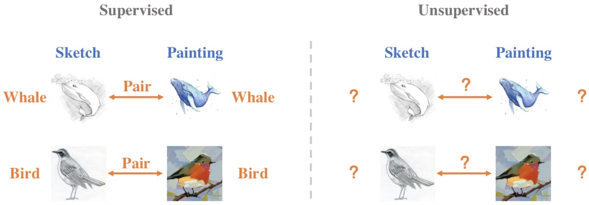

# Feature Representation Learning for Unsupervised Cross-domain Image Retrieval

This repository contains the PyTorch implementation for our ECCV2022 paper "[Feature Representation Learning for Unsupervised Cross-domain Image Retrieval](https://arxiv.org/abs/2207.09721)".



Current supervised cross-domain image retrieval methods can achieve excellent performance. However, the cost of data collection and labeling imposes an intractable barrier to practical deployment in real applications. In this paper, we investigate the unsupervised cross-domain image retrieval task, where class labels and pairing annotations are no longer a prerequisite for training. This is an extremely challenging task because there is no supervision for both in-domain feature representation learning and cross-domain alignment. We address both challenges by introducing: 1) a new cluster-wise contrastive learning mechanism to help extract class semantic-aware features, and 2) a novel distance-of-distance loss to effectively measure and minimize the domain discrepancy without any external supervision.

## Getting started
Clone this repository and create a virtual environment as the follows:
```
  conda create -n ucdir python=3.8.8
  conda activate ucdir
  conda install pytorch==1.8.0 torchvision==0.9.0 torchaudio==0.8.0 cudatoolkit=11.1 -c pytorch -c conda-forge
  pip install -r requirements.txt
```
## Download
### Datasets
* [Office-Home Dataset](https://www.hemanthdv.org/officeHomeDataset.html)
* [DomainNet Dataset](http://ai.bu.edu/M3SDA/)
### Pre-trained model
* [MoCo v2 model](https://github.com/facebookresearch/moco): Download the MoCov2 model trained after 800 epochs.


## Running
For Office-Home, you can modify line 7-8 in ./scripts/office-home.sh accordingly to train with the selected domain pair:
```
CUDA_VISIBLE_DEVICES=0 ./scripts/office-home.sh
```

For DomainNet, you can modify line 7-8 in ./scripts/domainnet.sh accordingly to train with the selected domain pair:
```
CUDA_VISIBLE_DEVICES=0 ./scripts/domainnet.sh
```

## Acknowledgement
This repository is built based on the source code for [MoCo v2](https://github.com/facebookresearch/moco)

## Citation
If you find our work helpful to your reseach, please cite our paper:
```
@inproceedings{hu2022feature,
  title={Feature Representation Learning for Unsupervised Cross-domain Image Retrieval},
  author={Hu, Conghui and Lee, Gim Hee},
  booktitle={Proceedings of the European Conference on Computer Vision (ECCV)},
  year={2022}}
```